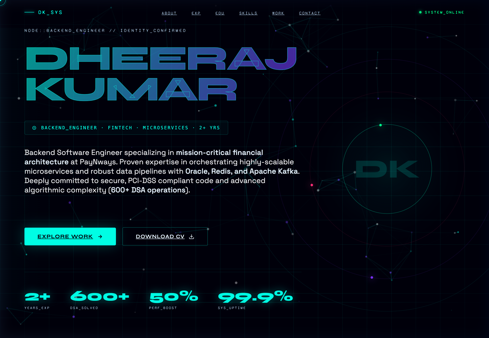

# Dheeraj Kumar — Portfolio

This repository contains my personal portfolio, a modern and high-performance interactive web application built to showcase my experience, skills, and projects as a Backend Software Engineer.

## 🚀 Live Demo
Simply open the `dheeraj_portfolio_3000.html` file in any modern web browser to view the portfolio.

## 📸 Preview

### Screenshot

### Video Walkthrough

## ✨ Features and UI Elements
- **Custom Cursor:** Unique tracked cursor with interactive states for links and buttons.
- **Dynamic Particle Background:** An interactive matrix/particle background that reacts to cursor movements.
- **Holographic Card Effects:** Beautiful hover and tilt effects on experience and project cards using CSS and JavaScript.
- **Scroll Reveals:** Smooth intro animations when scrolling through different sections (Experience, Education, Skills, Projects).
- **Responsive Design:** Optimized layout that seamlessly adapts to desktop, tablet, and mobile viewing.

## 🛠️ Technology Stack
- **Structure:** HTML5
- **Styling:** CSS3 (Custom variables, flexbox, CSS grid, keyframe animations)
- **Logic & Interactions:** Vanilla JavaScript (IntersectionObserver, Canvas API for particles, Event Listeners)

## 👤 About Me
I am a Backend Software Engineer with a focus on fintech, microservices, and robust architecture.
- **Current Role:** Software Engineer — Backend at PayNways India Pvt. Ltd.
- **Expertise:** Java, Spring Boot, Database Tuning (Oracle/MSSQL), Apache Kafka, Microservices Architecture. 
- **Education:** MCA from MNNIT Allahabad, BCA from Yashwantrao Chavan Maharashtra Open University.
- **Achievements:** 5-Star Gold Badge on HackerRank (DSA), 500+ LeetCode/CodeChef problems, and significant global rankings in CodeChef Starters.

## 🏗️ Selected Projects Showcased
- **Enterprise Digital Wallet:** High-throughput wallet supporting 500+ TPS with sub-200ms latency.
- **High-Throughput UPI Switch:** Payment routing engine utilizing Kafka for async, event-driven processing.
- **Hostel Desk:** Full-stack management platform (React, Node.js, MongoDB) for room allocation and student record management.
- **Programming Journal:** Performant backend routing and API logic with SSR enabled via Node.js and EJS.

## 📬 Contact
- **Email:** dheerajtocsi@gmail.com
- **LinkedIn:** [linkedin.com/in/dheerajtocsi](https://linkedin.com/in/dheerajtocsi)
- **GitHub:** [github.com/dheerajtocsi](https://github.com/dheerajtocsi)
- **LeetCode:** [leetcode.com/dheerajtocsi](https://leetcode.com/dheerajtocsi/)
